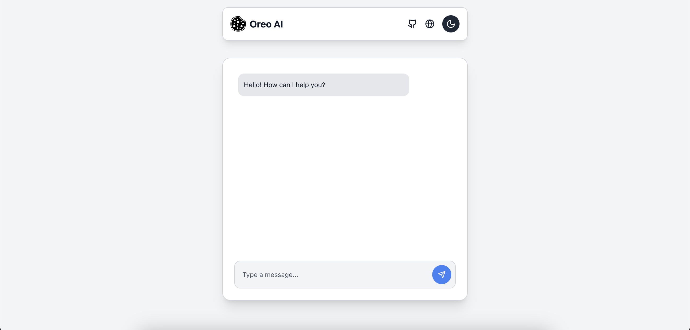
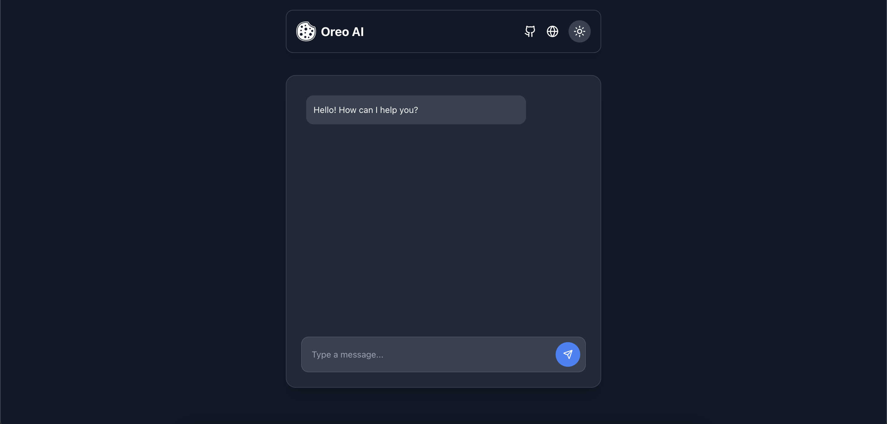

# Oreo AI (Web Version)

A sleek, responsive, and feature-rich AI-powered chat application built using **Next.js**, **Tailwind CSS**, and **Framer Motion**. This app provides a real-time messaging experience with a smooth UI and dark mode support.

## Features

- 💬 **Real-time Chat** with Oreo AI
- 🎨 **Dark & Light Mode** support
- ✨ **Smooth animations** using Framer Motion
- 🌐 **Responsive UI** optimized for mobile & desktop

## Tech Stack

- **Next.js** - Framework for React applications
- **Tailwind CSS** - For styling and UI components
- **Framer Motion** - For smooth animations
- **Lucide Icons** - For modern and sleek icons

## 📸 Screenshots

### Light Mode



### Dark Mode



## 🏗️ Installation & Setup

1. **Clone the repository:**

   ```sh
   git clone https://github.com/Volatile-Viv/oreo-web.git
   cd oreo-web
   ```

2. **Install dependencies:**

   ```sh
   npm install
   ```

3. **Run the development server:**
   ```sh
   npm run dev
   ```
   The app will be available at **`http://localhost:3000`**

## 📜 License

This project is open-source and available under the **MIT License**.

## 📞 Contact

For any inquiries or suggestions:

- 🔗 Portfolio: [volatileviv.com](https://volatileviv.com)
- 🐙 GitHub: [Volatile-Viv](https://github.com/yourusername)
